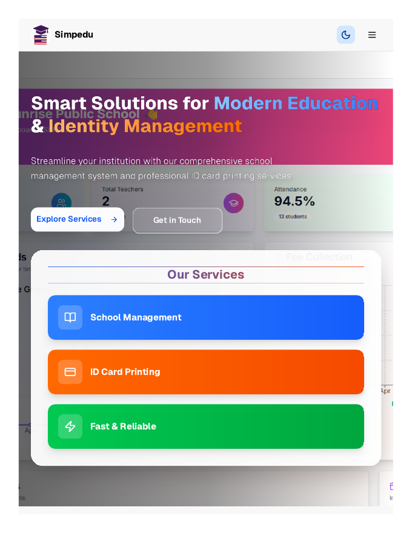

# SimpEdu — School Management & ID Card Services

> ## Status: 🟢 Completed
>
> <progress value="90" max="100"></progress>
>
> **Progress: 90%** — Complete multi-page static site, deployed on Vercel; content polish is all that remains

<p align="center">
  
</p>


## Screenshots

<p align="center">
  
  <br />
  <em>School management site — hero and services.</em>
</p>


## What it is

The marketing + services website for SimpEdu: school management software and ID-card printing services. A multi-page static site (home, about, services, ID cards, contact, 404) with responsive design, served as plain HTML/CSS/JS and deployed on Vercel. No build step, no backend — fast and simple.

## What works (verified)

- ✅ **Multi-page site** — home, about, services, id-cards, contact, custom 404
- ✅ **Responsive design** — mobile-friendly layouts
- ✅ **Zero-build deploy** — `npm run build` is a no-op by design; Vercel serves it directly
- ✅ **Local dev** — `python3 -m http.server 3000` (documented and works)
- ✅ **SEO basics** — per-page `index.html` files with proper structure

## Tech stack

| Layer | Tech |
|---|---|
| Markup | Plain HTML5 |
| Styling | CSS3 (custom, responsive) |
| Scripting | Vanilla JavaScript |
| Hosting | Vercel |

## How to run

No dependencies needed.

```bash
npm start
# or
python3 -m http.server 3000
# then open http://localhost:3000
```

Deploy: connect the repo to Vercel, or `vercel` from the CLI.

## Screenshots

No screenshots are committed in the repo (placeholder images exist in `assets/`). The banner above is generated; capturing the real pages would help.

## What you can add more

- [ ] **Real screenshots** — replace placeholder images with actual page captures
- [ ] **Quote/order form** — let schools request ID-card printing with a form
- [ ] **WhatsApp chat button** — standard for Indian SMB sites
- [ ] **Testimonials section** — social proof from schools served
- [ ] **Hindi language toggle** — widen the audience
- [ ] **Analytics** — basic visitor tracking

## Project structure

```
├── index.html          # Home
├── about/              # About page
├── services/           # Services page
├── id-cards/ / idcard/ # ID card printing pages
├── contact/            # Contact page
├── assets/             # Images, icons
├── banner.webp
├── vercel.json
└── package.json        # start/build scripts (static site)
```

---
*README written after code audit on 2026-10-08.*
